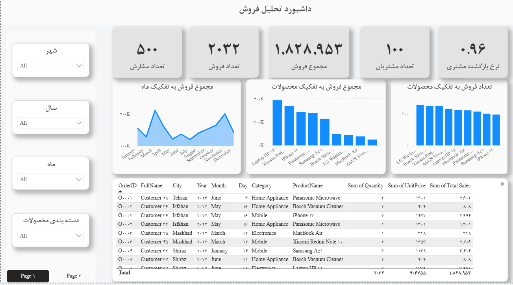

# 🛒 Electronics & Home Appliances Sales Analytics

یک داشبورد جامع هوش تجاری طراحی شده در Power BI برای تحلیل عملکرد فروش، بررسی رفتار مشتریان و ارزیابی سبد محصولات در یک فروشگاه لوازم الکترونیکی و خانگی.

## 📈 شاخص‌های کلیدی (KPIs)
* **مجموع درآمد:** ۱,۸۲۸,۹۵۳
* **تعداد سفارشات ثبت شده:** ۵۰۰
* **تعداد مشتریان یکتا:** ۱۰۰
* **نرخ بازگشت مشتری (Retention Rate):** ۹۶٪

## 🛠️ ابزارها و تکنولوژی‌ها
* **Power BI:** طراحی رابط کاربری تعاملی و مصورسازی داده‌ها.
* **DAX:** توسعه مژرها برای محاسبه مجموع فروش، تعداد مشتریان، و به ویژه محاسبه دقیق نرخ بازگشت مشتری.
* **Data Modeling:** پیاده‌سازی مدل داده رابطه‌ای میان ابعاد (مشتریان، محصولات، زمان) و جدول حقایق (سفارش‌ها).
* **Data cleaning:**پیش پردازش داده .

## 📊 صفحات داشبورد و بینش‌های استخراج شده

### ۱. داشبورد تحلیل فروش (Sales Dashboard)
این صفحه بر روی عملکرد محصولات و روند زمانی فروش تمرکز دارد.
* **روند فروش:** بررسی نوسانات فروش در ماه‌های مختلف سال نشان‌دهنده پیک فروش در ماه‌های آوریل و نوامبر است.
* **عملکرد محصول:** اگرچه ماشین لباسشویی ال‌جی از نظر *تعداد* فروش بالایی دارد، اما بار اصلی درآمدزایی بر عهده لوازم الکترونیکی نظیر لپ‌تاپ و گوشی‌های هوشمند است.
* **جزئیات سفارشات:** یک جدول ماتریسی دقیق برای پیگیری شناسه سفارش، نام مشتری، محصول و مبلغ پرداختی با قابلیت فیلتر شدن.

### ۲. داشبورد تحلیل رفتار مشتری (Customer Dashboard)
این صفحه به منظور شناسایی مشتریان ارزشمند و تحلیل جغرافیایی طراحی شده است.
* **پراکندگی جغرافیایی:** شهر شیراز با ۲۷ مشتری، پیشتاز جذب مشتری در میان شهرها (تهران، مشهد، اصفهان، تبریز) است.
* **مشتریان VIP:** شناسایی مشتریانی که بیشترین خرید ریالی (مانند مشتری C037) و بیشترین تعداد خرید (با استفاده از Word Cloud) را داشته‌اند.
* **جذب مشتری:** تحلیل روند نام‌نویسی مشتریان جدید در طول زمان برای ارزیابی کمپین‌های بازاریابی.

---
**نحوه اجرای پروژه:**
برای مشاهده تعاملی داشبورد و بررسی ساختار مدل داده، فایل `.pbix` موجود در این مخزن را دانلود کرده و با استفاده از نرم‌افزار Power BI Desktop اجرا نمایید.
